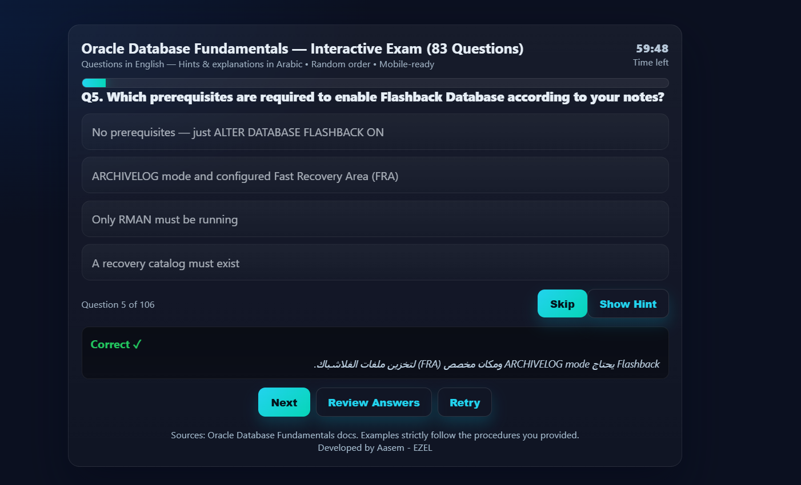

<<<<<<< HEAD

# Oracle Database Fundamentals — Interactive Exam
=======
# Interactive Exam Center — Oracle & Linux

A small single-page interactive exam app built with plain HTML, modern CSS and vanilla JavaScript. Questions are written in English with Arabic hints; the UI is responsive and mobile-friendly.



## Features

- Timer-driven quiz experience (default: 60 minutes)
- Multiple choice (MCQ), True/False (T/F), and ordering questions
- Instant feedback with Arabic hints
- Review mode to see correct answers and hints
- Works well on mobile devices

## Quick Start (Run locally)

No build step required. Open the app in your browser:

1. Download or clone the repository.
2. Open `index.html` in your browser, or open one of the course pages in the `Courses/` folder.

Example (PowerShell):

```powershell
Start-Process .\index.html
```

Direct course pages:

- `Courses/IIS406.html` — Oracle exam page
- `Courses/IOS305.html` — Linux exam page

## Project structure

```
index.html                 # Landing page with links to course exams
styles.css                 # App styles and CSS variables (theme)
preview.png                # Screenshot used in README
js/app.js                  # Quiz engine: timer, rendering, handlers, review
js/questions-oracle.js     # Oracle question bank (window.questionsMaster)
js/questions.js            # Optional: other question banks
Courses/                   # Course-specific HTML files (IIS406.html, IOS305.html)
README.md                  # This file (English)
```

## Where to edit questions

- Oracle question bank lives in `js/questions-oracle.js` and defines `window.questionsMaster`.
- To add a new exam, create a new questions file (e.g. `js/questions-ios305.js`) and expose the array expected by `js/app.js` (for example `window.questionsIOS305`).

Question object shape (examples):

- Common fields: `type`, `q`, optional `hint`
- MCQ: `type: 'mcq'`, `choices: [...]`, `ans: <index>`
- True/False: `type: 'tf'`, `ans: true|false`
- Order: `type: 'order'`, `items: [...]`, `solution: [indexes]`

Example:

```javascript
{ type: 'mcq', q: 'What is SQL?', choices: ['A language','An OS','A file'], ans: 0, hint: 'SQL is a query language' }
```

Note: When opening a course page, `js/app.js` looks for a course-specific array (it checks the pathname for `ios305` and will use `window.questionsIOS305` if present). Otherwise it falls back to `window.questionsMaster`.

## Theming

- Customize colors and the theme by editing CSS variables at the top of `styles.css` (under `:root`, e.g. `--accent`, `--bg`).

## Development notes

- No external dependencies; edit files and refresh the browser to see changes.
- Timer default is set in `js/app.js` as `totalSeconds = 60 * 60`. Change that value to alter the test duration.
- Keep the question object fields intact to avoid runtime errors.

## License / Usage

This project is provided for educational purposes. Review your organization or school policies before using it in production.

## Credits
Developed by Asim — EZEL.

